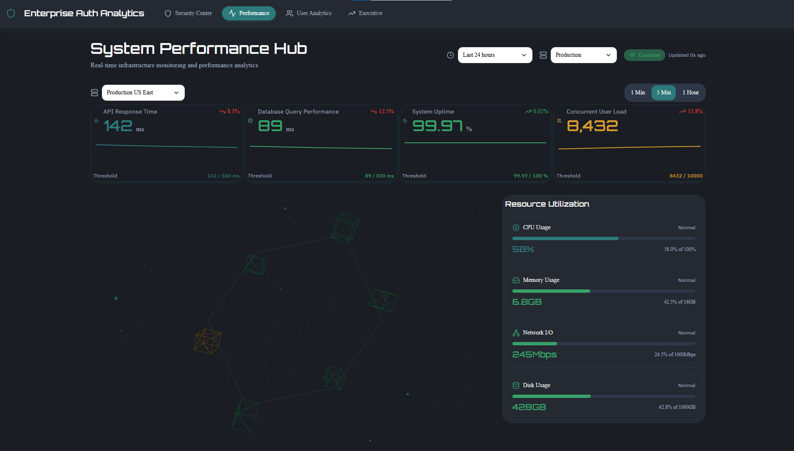

# Security Dashboard


[](https://enterprise-auth-analytics.vercel.app)

An enterprise-grade security analytics platform providing real-time monitoring, threat detection, and comprehensive system insights across multiple domains.

---

## Live Demo

### [👉 View Live Dashboard](https://security-dashboard-amber.vercel.app)

*(Note: The dashboard is fully responsive and optimized for modern browsers)*

---

## Dashboard Preview


*(Screenshot of the main dashboard view)*

---

## Overview

This application delivers a unified security operations center with four specialized dashboards:

- **Security Command Center**: Real-time threat monitoring and authentication analytics
- **Executive Overview**: High-level KPIs and automated security insights
- **System Performance Hub**: Infrastructure monitoring and resource management
- **User Analytics Dashboard**: User behavior analysis and conversion tracking

## Tech Stack

**Core Framework**
- React 18.2 with modern hooks and concurrent features
- Vite 5.4 for optimized build pipeline and HMR

**State Management & Routing**
- Redux Toolkit 2.6 for predictable state management
- React Router DOM 6.0 for client-side routing

**UI & Visualization**
- Tailwind CSS 3.4 with custom utility extensions
- Recharts 2.15 & D3.js 7.9 for data visualization
- Three.js 0.182 for 3D system architecture rendering
- Framer Motion 10.16 for animations

**Development Tools**
- Axios for HTTP client
- React Hook Form for form validation
- date-fns for date manipulation
- Lucide React for icons

## Prerequisites

- Node.js >= 16.x
- npm >= 8.x or yarn >= 1.22

## Installation

```bash
# Clone repository
git clone [https://github.com/firdavs244/SecurityDashboard.git](https://github.com/firdavs244/SecurityDashboard.git)
cd SecurityDashboard

# Install dependencies
npm install

# Start development server
npm start

```

The application runs on `http://localhost:5173`

## Available Scripts

```bash
npm start       # Start development server
npm run build   # Production build with source maps
npm run serve   # Preview production build locally

```

## Project Architecture

```
src/
├── components/
│   ├── layout/              # Header, controls, context selectors
│   └── ui/                  # Reusable UI primitives (Button, Input, Select)
├── pages/
│   ├── executive-overview/
│   ├── security-command-center/
│   ├── system-performance-hub/
│   └── user-analytics-dashboard/
├── styles/                  # Global styles and Tailwind config
├── utils/                   # Helper functions
├── App.jsx                  # Root component
├── Routes.jsx               # Route definitions
└── index.jsx                # Application entry point

```

## Key Features

### Security Command Center

* Geographic login visualization with threat heatmaps
* Real-time authentication event monitoring
* Automated threat detection and alerting
* Failed login attempt tracking

### Executive Overview

* Executive summary tables with trend analysis
* Automated security insights generation
* User growth metrics and KPI tracking
* Security posture assessment

### System Performance Hub

* 3D system architecture visualization
* Real-time resource gauges (CPU, Memory, Disk)
* Performance timeline with granular metrics
* Server cluster health monitoring
* Alert management panel

### User Analytics Dashboard

* Geographic user distribution mapping
* Acquisition channel performance
* Conversion funnel visualization
* Demographic breakdown analysis
* Device and browser analytics
* Registration trend analysis

## Configuration

Environment variables can be configured in `.env`:

```env
VITE_API_BASE_URL=your_api_endpoint
VITE_MAP_API_KEY=your_map_api_key

```

## Performance Optimization

* Code splitting per route
* Lazy loading for dashboard components
* Optimized bundle size with Vite tree-shaking
* Memoized expensive computations
* Virtual scrolling for large data sets

## Browser Support

* Chrome/Edge >= 90
* Firefox >= 88
* Safari >= 14

## Contributing

1. Fork the repository
2. Create feature branch (`git checkout -b feature/improvement`)
3. Commit changes (`git commit -am 'Add new feature'`)
4. Push to branch (`git push origin feature/improvement`)
5. Open Pull Request

## License

MIT License - see LICENSE file for details

## Contact

Repository: [github.com/firdavs244/SecurityDashboard](https://github.com/firdavs244/SecurityDashboard)
